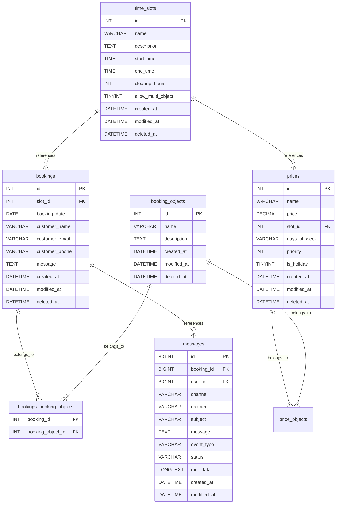

# snippen-booking
Booking modul for snippen grendehus

## 🚀 TL;DR / Hurtigstart

Kjør følgende i container-terminalen for å komme i gang:

```bash
# 1. Start/sikre at bakgrunnstjenester (MariaDB, Apache, WP) kjører:
/entrypoint.sh &

# Merk: Dersom MariaDB eller Apache ikke kommer igang på første forsøk (f.eks. pga. eksisterende PID-filer),
# kan du stoppe prosessen (Ctrl+C) og kjøre /entrypoint.sh & én gang til.

# 2. Sett opp demodata og miljø:
composer demo

# 3. Test/Trigg automatiske betalingspurringer manuelt:
composer demo:reminders
```

Etter dette er nettsiden tilgjengelig på [http://localhost:8080](http://localhost:8080) (Admin: `admin` / `admin`).

## Container-based development

This repository uses a VS Code devcontainer to run WordPress with MariaDB locally.

### Start the devcontainer

1. Open the repository in VS Code.
2. Use `Remote Containers: Reopen in Container` (or `Dev Containers: Reopen in Container`).
3. Wait for the devcontainer build and `postCreateCommand` to finish.


### Access WordPress

- Site URL: `http://localhost:8080`
- Admin URL: `http://localhost:8080/wp-admin/`
- Admin credentials:
  - Username: `admin`
  - Password: `admin`

### Plugin development

- Plugin source lives in `src/wp-content/plugins/booking-plugin`
- The devcontainer symlinks this folder into WordPress at `wp-content/plugins/snippen-booking`
- Use the container terminal to run commands like `wp plugin list`, `wp plugin activate snippen-booking`, and other WP-CLI commands
- The devcontainer setup automates WordPress installation so you should not need to complete the web install wizard manually
- Database: MariaDB with database `wordpress`, user `wpuser`, password `wppass`
- Access MariaDB prompt directly via terminal: `mariadb wordpress` (eller `mysql -u root wordpress`)

### Testing

The plugin includes a comprehensive test suite covering both unit and integration tests.

#### Running Tests

Use composer to run the tests from the container terminal:

```bash
# Run all tests (Unit + Integration - full suite run in CI/CD)
composer test

# Run only unit tests (fast local feedback)
composer test:unit

# Run fast unit tests (stops on first failure)
composer test:fast

# Run only integration tests
composer test:integration

# Run JavaScript tests (Jest)
npm run test:js

# Run fast UI & visual regression tests (Playwright - < 5s)
npm run test:ui:fast

# Update visual golden baselines after intentional UI changes
npm run test:ui:update
```

#### Local Development vs. CI/CD Strategy
- **Local Development**: Use `composer test:unit` or `composer test:fast` during active code changes for near-instant execution (~0.6 seconds). Use `composer lint` (and `composer lint:fix` or `phpcbf`) to ensure code compliance.
- **UI & Visual Regression**: When actively modifying frontend templates, modal layouts, or CSS, run `npm run test:ui:fast` to ensure no visual regressions across desktop and mobile viewports. Local execution runs against isolated fixtures in ~2 seconds without requiring full database/server boot.
- **Pre-commit / Pre-PR**: Run `composer test`, `composer lint`, and `npm run test:ui:fast` locally to verify the entire test suite and code standards before pushing.
- **CI/CD Pipeline**: GitHub Actions (`.github/workflows/phpunit.yml` and `.github/workflows/ui-tests.yml`) executes PHPCS linting, the full PHP test suite, JS unit tests, and Playwright visual regression tests automatically on push and pull requests.

### Development Tools

#### Booking Demo Page
Upon plugin activation, a "Booking Demo" page is automatically created in WordPress. This page contains the `[snippen_booking]` shortcode and can be used for immediate manual testing of the booking form and calendar.

#### Commands & Entrypoint (`/entrypoint.sh`)
Skriptet `/entrypoint.sh` håndterer oppstart og klargjøring av tjenestene (MariaDB, WordPress-installasjon, symlinking av plugin, samt Apache i forgrunnen).

- **Start bakgrunnstjenester**: `/entrypoint.sh &` eller `bash /entrypoint.sh`
- **Reset environment**: `bash /entrypoint.sh reset` (sletter `wp-config.php` og databasen)
- **Setup environment**: `bash /entrypoint.sh setup` (laster ned WP, oppretter konfigurasjon, installerer og aktiverer pluginet uten å starte Apache i forgrunnen)

##### Instabilitet ved oppstart / Kjent oppføring
Dersom `/entrypoint.sh` stopper uventet eller tjenestene ikke kommer helt i gang på første forsøk:
1. Dette skyldes som regel at MariaDB-tjenesten trenger en ekstra restart eller at et tidligere Apache/MariaDB PID-flagg lå igjen.
2. Løsning: Kjøre `/entrypoint.sh` / `/entrypoint.sh setup` én ekstra gang i terminalen før du kjører `composer demo`.

#### Demo Data
The plugin includes tools to populate the environment with demo data for development and testing.

Det opprettes også en WordPress admin-bruker med brukernavn `admin` og passord `admin`.

```bash
# Run the full demo environment setup (users, bookings, pages, test user, sms settings)
composer demo

# Clear all demo data (bookings, demo users, demo pages)
composer demo:clean  # Also available as composer demo:clear or composer demo:reset

# The full setup command runs these individual scripts in order:
composer demo:users      # Generate 50 demo subscriber users
composer demo:bookings   # Generate random bookings for the next 30 days
composer demo:pages      # Create demo pages (booking forms and account confirmation)
composer demo:me         # Create/update an admin test user (uses TEST_USER_* in .env)
composer demo:env        # Update KeySMS settings from local .env
```

#### Environment Configuration (`.env` & `.env.example`)
Prosjektet benytter en `.env`-fil i rotmappen for lokal konfigurasjon under utvikling (f.eks. for KeySMS integration, test-bruker, og SMTP-innstillinger). 

- **`.env.example`**: Malfil som ligger i versjonskontroll. Denne viser alle støttede miljøvariabler og eksempelveidier.
- **`.env`**: Din lokale konfigurasjonsfil. Hvis `.env` ikke eksisterer når du kjører setup/demo-skript (som `composer demo`), vil `.env` automatisk bli kopiert fra `.env.example`.

**Støttede konfigurasjonsgrupper i `.env`:**
- **KeySMS Settings**: `KEYSMS_USERNAME`, `KEYSMS_API_KEY`, `SMS_SENDER`, `SMS_BOOKING_CONFIRMATION_ENABLED`, `SMS_ACCOUNT_CONFIRMATION_ENABLED`. Kjøring av `composer demo` / `composer demo:env` oppdaterer KeySMS-innstillingene i WordPress automatisk fra disse variablene.
- **Test User Settings**: `TEST_USER_EMAIL`, `TEST_USER_PHONE`, `TEST_USER_NAME`, `TEST_USER_PASS`. Brukes av `composer demo:me` til å opprette/oppdatere en beboer/testbruker.
- **SMTP / Email Settings**: `SMTP_HOST`, `SMTP_PORT`, `SMTP_ENCRYPTION`, `SMTP_USER`, `SMTP_PASS`, `SMTP_FROM_EMAIL`, `SMTP_FROM_NAME`. Brukes dersom du ønsker å teste reell utsending av e-post via SMTP.


### GitHub Integration

The development environment includes the [GitHub CLI (`gh`)](https://cli.github.com/). This tool is used by both developers and AI agents to manage issues and pull requests directly from the terminal.

#### Authentication
To use GitHub features, you must be logged in:
```bash
gh auth login
```
Follow the prompts to authenticate via your browser or with a Personal Access Token (PAT).

#### Solving Issues
For information on how AI agents (and developers) should workflow GitHub issues, see [AGENTS.md](AGENTS.md).

### Notes

- Port `8080` is forwarded from the container to your host.
- Xdebug warnings about `host.docker.internal:9003` are normal if you don’t have a debugger attached.
- If you change the plugin or config and the site stops working, rebuild/reopen the devcontainer and/or delete `/wordpress/wp-config.php` to force reconfiguration.

### Security Best Practices

The plugin includes a centralized `SnippenBooking\Helper\Security` class for common security operations. When adding new features, follow these patterns:

#### Nonce Verification
All state-changing AJAX endpoints must verify a nonce:
```php
// In AJAX handlers (dies with JSON error on failure):
Security::verify_ajax_nonce( 'snippen_booking_nonce' );

// For public endpoints (nopriv), verify only for logged-in users:
if ( is_user_logged_in() ) {
    check_ajax_referer( 'snippen_booking_nonce', 'nonce', false );
}
```

#### Input Sanitization
Use the Security helper for safe request access:
```php
$name   = Security::get_post_text( 'name' );
$id     = Security::get_post_int( 'id' );
$filter = Security::get_query_text( 'status', 'all' );
```

#### Output Escaping
Always escape dynamic output in templates:
- HTML content: `esc_html()`
- HTML attributes: `esc_attr()`
- URLs: `esc_url()`

#### SQL LIKE Queries
Always escape user input before using in LIKE clauses:
```php
$like_search = '%' . $wpdb->esc_like( $search_term ) . '%';
$query .= $wpdb->prepare( ' AND name LIKE %s', $like_search );
```

### Uninstall Process

The plugin implements a proper `uninstall.php` to clean up its footprint when a site administrator deletes the plugin from WordPress.
- **What is deleted:** Database tables, `snippen_%` options, `snippen_%` user meta, scheduled cron jobs, and custom capabilities from all roles.
- **Preserve Data Setting:** An option is available in the plugin settings to skip this destructive cleanup, which is useful for temporary deactivation or troubleshooting in production. The `uninstall.php` script respects this setting.

## NB: test site

Use [tastewp.com](https://tastewp.com). This is perhaps the easiest service. You just go to the site, press "Set it up!", and you get a ready-to-use WordPress site that lasts for 48 hours. Here you can go into the admin panel, upload your .zip file under Plugins, and check that everything works and looks good.

## Database Schema



## Pluggable Notification System

The plugin supports a pluggable notification architecture, allowing you to easily add new SMS or email delivery providers via WordPress filter hooks.

### Creating a Custom SMS Provider

To create a custom SMS provider (for example, using Twilio), you must implement `SnippenBooking\Service\Notification\SmsProviderInterface`:

```php
use SnippenBooking\Service\Notification\SmsProviderInterface;

class TwilioSmsProvider implements SmsProviderInterface {

    public function get_id(): string {
        return 'twilio';
    }

    public function get_name(): string {
        return 'Twilio SMS';
    }

    public function get_settings_schema(): array {
        return array(
            array(
                'key'         => 'snippen_twilio_sid',
                'label'       => 'Twilio Account SID',
                'type'        => 'text',
                'required'    => true,
                'description' => 'Finn denne i Twilio Console.',
            ),
            array(
                'key'         => 'snippen_twilio_token',
                'label'       => 'Twilio Auth Token',
                'type'        => 'password',
                'required'    => true,
                'description' => 'Hold denne hemmelig.',
            ),
            array(
                'key'         => 'snippen_twilio_from',
                'label'       => 'Twilio Telefonnummer',
                'type'        => 'text',
                'required'    => true,
            ),
        );
    }

    public function is_configured(): bool {
        $sid   = get_option('snippen_twilio_sid');
        $token = get_option('snippen_twilio_token');
        $from  = get_option('snippen_twilio_from');
        return !empty($sid) && !empty($token) && !empty($from);
    }

    public function send_sms(string $to, string $message): bool {
        $sid   = get_option('snippen_twilio_sid');
        $token = get_option('snippen_twilio_token');
        $from  = get_option('snippen_twilio_from');

        // Execute HTTP requests or use the SDK to send the SMS.
        return true;
    }
}
```

### Registering Your Provider

Register your custom provider using the `snippen_booking_notification_providers` filter hook:

```php
add_filter('snippen_booking_notification_providers', function($providers) {
    $providers[] = new TwilioSmsProvider();
    return $providers;
});
```

Once registered, your provider will automatically appear as a card inside **Innstillinger > Varslingstilbyder (Transport)**, and its configuration fields will be rendered dynamically!

### Notification Events and Template Contexts (`connected_to`)

The notification system uses event identifiers (`connected_to`) to bind editable email and SMS templates to specific domain lifecycle events:

| Context Key (`connected_to`) | Aliases | Description / Trigger | Default Channels |
|---|---|---|---|
| `account-activation` | `user_activation` | Triggered when a new user registers and needs a verification code | Email, SMS |
| `booking-confirmation` | `booking_confirmation` | Sent to customer when a booking request is initially created | Email, SMS |
| `admin-booking-alert` | `admin_booking` | Sent to booking administrators when a new booking request is submitted | Email, SMS |
| `password-reset` | `password_reset` | Sent to user when requesting a password reset link | Email, SMS |
| `payment-reminder` | `payment_reminder` | Scheduled reminder sent to customer for unpaid bookings | Email, SMS |
| `payment-receipt-uploaded` | `payment_receipt_uploaded` | Sent to administrators when a customer uploads payment documentation | Email, SMS |
| `booking-confirmed` | `booking_confirmed` | Sent to customer when admin confirms/approves their booking reservation | Email, SMS |
| `payment-received` | `payment_received`, `payment-paid` | Sent to customer when payment status is registered as `PAID` | Email, SMS |

Each event can be toggled on/off independently per channel in **Innstillinger > E-post** and **Innstillinger > KeySMS**, and standard templates can be customized with placeholders under **Notifikasjonsmaler**.

## Pluggable Resident Import System

The plugin also supports a pluggable architecture for importing residents. You can easily add new import formats (like CSV, custom text formats, or integrations with external systems) via WordPress filter hooks.

### Creating a Custom Import Provider

To create a custom import provider, you should implement `SnippenBooking\Import\ResidentImportProviderInterface` or extend `SnippenBooking\Import\Provider\AbstractResidentImportProvider` (which includes helpful `upsert_resident` methods).

```php
use SnippenBooking\Import\Provider\AbstractResidentImportProvider;
use SnippenBooking\Import\ResidentImportResult;

class CsvResidentImportProvider extends AbstractResidentImportProvider {

    public function get_id(): string {
        return 'csv_import';
    }

    public function get_name(): string {
        return 'CSV Import';
    }

    public function get_description(): string {
        return 'Importer beboere fra en CSV-fil.';
    }

    public function render_ui(): void {
        echo '<div class="snippen-form-group">';
        echo '<label for="snippen_import_data_csv">Lim inn CSV data</label>';
        echo '<textarea name="snippen_import_data" id="snippen_import_data_csv" rows="15" style="width:100%;"></textarea>';
        echo '</div>';
    }

    public function import( $input ): ResidentImportResult {
        $result = new ResidentImportResult();
        $raw_data = isset( $input['snippen_import_data'] ) ? trim( $input['snippen_import_data'] ) : '';

        // 1. Parse CSV data from $raw_data
        // 2. Call $user_id = $this->upsert_resident($name, $email, $phone) for each valid row
        // 3. Keep track of successes and logs
        //    $result->success++;
        //    $result->imported_ids[] = $user_id;

        return $result;
    }
}
```

### Registering Your Import Provider

Register your custom provider using the `snippen_booking_import_providers` filter hook:

```php
add_filter('snippen_booking_import_providers', function($providers) {
    $providers[] = new CsvResidentImportProvider();
    return $providers;
});
```

Once registered, your provider will automatically appear in the dropdown menu on the **Beboer Import** page, and its custom UI will be rendered when selected!

## Payment Management System

The plugin includes a manual payment tracking system, allowing users to view payment details and upload receipt screenshots or PDFs, while administrators can manage payment status, view uploaded receipts, record notes, and filter bookings.

### Key Classes & Components
- **`SnippenBooking\Service\PaymentService`**: Helper service for retrieving payment statuses (`UNPAID`, `PENDING_VERIFICATION`, `PAID`, `EXEMPT`), status details, and dispatching admin email notifications upon receipt upload.
- **`SnippenBooking\Api\UploadPaymentReceiptApi`**: AJAX endpoint (`snippen_upload_payment_receipt`) for file upload validation (JPEG, PNG, WEBP, PDF) and storing receipt attachments in the WP Media Library. Supports guest authorization via booking UUID.
- **`SnippenBooking\Api\UpdatePaymentStatusApi`**: AJAX endpoint (`snippen_update_payment_status`) for administrators (`manage_bookings`) to update payment status and notes.
- **`SnippenBooking\Database\Migrations\Migration_2_6_0`**: Database migration creating table `wp_snippen_payment_statuses` and adding payment metadata columns to `wp_snippen_bookings`.

## SMS Gateway REST API Synchronization

The plugin integrates with the `snippen-sms-service` daemon via REST API endpoints under `/wp-json/snippen/v1/sms`.

### Architecture & Endpoints

```text
┌─────────────────────────────────────────────────────────┐
│                      snippen-booking                    │
│  - snippen_sms_service Provider (logs queued in DB)     │
│  - SmsGatewayApi REST Controller                        │
└──────────────────────────┬──────────────────────────────┘
                           │ HTTP REST (Bearer / X-API-Key)
                           ▼
┌─────────────────────────────────────────────────────────┐
│                    snippen-sms-service                  │
│  - Polls GET /outbox                                    │
│  - Dispatches SMS via hardware modem/provider           │
│  - Reports status via POST /outbox/status               │
│  - Syncs incoming SMS via POST /inbox                   │
│  - Resolves active bookings via GET /bookings?phone=... │
└─────────────────────────────────────────────────────────┘
```

1. **`GET /wp-json/snippen/v1/sms/outbox`**: Fetches pending outbound SMS messages (`status = 'queued'`).
2. **`POST /wp-json/snippen/v1/sms/outbox/status`**: Updates outbound SMS message status (`sent` or `failed`) with gateway and modem metadata.
3. **`POST /wp-json/snippen/v1/sms/inbox`**: Receives reported inbound SMS messages from tenants and executes the prioritized 6-rule resolution engine:
   - **Rule 1 (Active Session)**: Within conversation TTL (`snippen_sms_conversation_ttl_minutes`, default 120m), automatically inherits previous booking context. If a new booking is created or another active booking is modified after the latest session activity, the session is interrupted and falls through to Rule 4 for disambiguation. Replying with a choice re-establishes the active session on the chosen booking.
   - **Rule 2 (Disambiguation Selection)**: Parses tenant choices (`1`, `2`, `nr 1`, `første`, `andre`), associates the chosen booking, and resolves pending messages.
   - **Rule 3 (Single Active Booking)**: Unambiguously matches single active reservation (`status = 'received'`).
   - **Rule 4 (Multiple Active Bookings)**: Enters quarantine (`status = 'pending_selection'`) and dispatches a numbered SMS disambiguation prompt.
   - **Rule 5 (Registered User without Active Booking)**: Associates `user_id` with `booking_id = NULL` (`status = 'general_inquiry'`).
   - **Rule 6 (Unknown Sender)**: Safely quarantines message (`status = 'quarantine'`) for admin review.
4. **`GET /wp-json/snippen/v1/sms/inbox`**: Queries and filters inbound SMS messages by `status` (`received`, `pending_selection`, `general_inquiry`, `quarantine`), `booking_id`, `user_id`, or search text with pagination.
5. **`GET /wp-json/snippen/v1/sms/bookings`**: Looks up active bookings associated with a given phone number (`?phone=+47...`).

#### Admin SMS Innboks & Karantene

Administrators can navigate to **Snippen Booking → SMS Innboks** (`admin.php?page=snippen-booking-sms-inbox`) to:
- Monitor all inbound SMS traffic and matched resolution rules.
- Filter messages by status (Quarantine, Pending selection, General inquiries, Resolved bookings).
- Manually assign unassociated or quarantined messages to a booking with a single click.

### SMS Gateway & E2E Test Provisioning (`composer demo:gateway`)

For integration testing alongside `snippen-sms-service` and `snippen-testing`:

```bash
# Set up SMS gateway provider and seed test user, booking, and outbox message (+4799887766)
composer demo:gateway

# Run container healthcheck (verifies WordPress and /wp-json/snippen/v1/sms/outbox)
composer healthcheck
# or directly:
bash bin/healthcheck.sh
```

### Simuler innkommende SMS (`composer demo:inbox`)

For å teste toveis SMS-innboks (`POST /wp-json/snippen/v1/sms/inbox`), oppløsningsmotor og flervalgslogikk manuelt fra kommandolinjen:

```bash
# Grunnleggende syntaks
composer demo:inbox <telefonnummer> "<meldingstekst>" [--token=<token>] [--raw]

# Enkelt booking (avsender matches til leietakers aktive reservasjon)
composer demo:inbox 99887766 "Hei, hva er koden til ytterdøren?"

# Med norsk landskode (+47)
composer demo:inbox +4799887766 "Takk for info!"

# Flervalgsrespons (når bruker har flere bookinger og svarer på valg-SMS)
composer demo:inbox 99887766 "1"

# Ukjent avsender (rutes til karantene for manuell oppfølging)
composer demo:inbox 91234567 "Hei, ønsker å leie lokalet til neste år"

# Rå JSON-respons (for automatisert testing eller piping til jq)
composer demo:inbox 99887766 "Status" raw
# eller:
composer demo:inbox -- 99887766 "Status" --raw

# Teste autorisasjonsfeil (401/403) med overstyrt token
composer demo:inbox 99887766 "Test" token=feil-token
# eller:
composer demo:inbox -- 99887766 "Test" --token=feil-token
```

#### Funksjonalitet og virkemåte:
- **Automatisk normalisering**: Telefonnummer normaliseres via `PhoneHelper`. Hvis 8 siffer oppgis (f.eks. `99887766`), legges automatisk `+47` til.
- **Hierarkisk tokenhåndtering**:
  1. CLI-overstyring (`--token=...`, `token=...`).
  2. WordPress-innstilling (`get_option('snippen_sms_service_api_token')`).
  3. Miljøvariabel (`SNIPPEN_SMS_API_TOKEN` i `.env`).
  4. Auto-oppsett: Dersom token ikke er satt, konfigureres automatisk `'test-integration-token'`.
- **Sømløs transport**: Forsøker HTTP POST mot `/wp-json/snippen/v1/sms/inbox`. Dersom lokal webserver ikke kjører i miljøet, faller skriptet automatisk tilbake til intern dispatch (`rest_do_request()`).
- **Strukturert rapport**: Gir umiddelbar oversikt over transport, HTTP-status, løsningsstatus (`received`, `pending_selection`, `general_inquiry`, `quarantine`), oppløsningsregel, tilknyttet booking/bruker og innholdet i generert valg-SMS dersom utgående prompt ble lagt i utboksen.

### Headless Container Startup & Environment Variables

The container entrypoint (`.devcontainer/docker-entrypoint.sh` / `Dockerfile`) supports automated headless execution without interactive prompts:

| Variable | Description | Default |
| --- | --- | --- |
| `PORT` | Apache listen port | `8080` |
| `WP_URL` | WordPress Site URL / Hostname | `http://${HTTP_HOST:-localhost}:${PORT}` |
| `SNIPPEN_SMS_API_TOKEN` | SMS Gateway API Token | `test-integration-token` |
| `SNIPPEN_SMS_SENDER` | Outbound SMS sender label | `Snippen` |
| `INIT_GATEWAY` | Run `composer demo:gateway` automatically on container start | `false` |
| `INIT_DEMO` / `AUTO_DEMO` | Run full `composer demo` automatically on container start | `false` |
| `MYSQL_HOST` / `MYSQL_USER` / `MYSQL_PWD` | Database connection details | `localhost` / `wpuser` / `wppass` |

## Modal & Overlay Architecture

All modal and overlay dialogs across the plugin (direct-link booking UUID popup, calendar booking info modal, rental terms iframe modal, and admin notification dispatch dialog) adhere to standard mobile-friendly and responsive rules:

- **Viewport containment**: Overlays use `height: 100dvh` (with fallback `100%`) and modals use `max-height: calc(100dvh - 32px)` (`calc(100dvh - 16px)` on mobile) so modals never exceed the screen dimensions or get clipped under dynamic mobile toolbars/address bars (e.g. iOS Safari and Android Chrome).
- **Fixed Header & Independent Scrolling**: Modals are structured with a fixed header (`flex-shrink: 0`) and scrollable body (`overflow-y: auto`, `overscroll-behavior: contain`), ensuring the modal title and close button remain permanently pinned and accessible at the top while content scrolls.
- **Scroll Locking**: When any overlay is active, the `body.snippen-modal-open` class is applied to lock the background page from scrolling (`overflow: hidden !important;`).
- **Dismissal**: Modals can be dismissed via:
  1. The close button (`&times;`) in the header.
  2. Clicking on the semi-transparent overlay backdrop.
  3. Pressing the keyboard `Escape` key.

