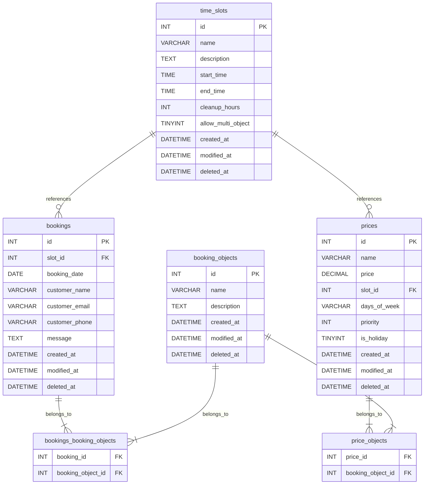

# snippen-booking
Booking modul for snippen grendehus

## Container-based development

This repository uses a VS Code devcontainer to run WordPress with MariaDB locally.

### Start the devcontainer

1. Open the repository in VS Code.
2. Use `Remote Containers: Reopen in Container` (or `Dev Containers: Reopen in Container`).
3. Wait for the devcontainer build and `postCreateCommand` to finish.

### Access WordPress

- Site URL: `http://localhost:8080`
- Admin URL: `http://localhost:8080/wp-admin/`
- Admin credentials:
  - Username: `admin`
  - Password: `admin`

### Plugin development

- Plugin source lives in `src/wp-content/plugins/booking-plugin`
- The devcontainer symlinks this folder into WordPress at `wp-content/plugins/snippen-booking`
- Use the container terminal to run commands like `wp plugin list`, `wp plugin activate snippen-booking`, and other WP-CLI commands
- The devcontainer setup automates WordPress installation so you should not need to complete the web install wizard manually
- Database: MariaDB with database `wordpress`, user `wpuser`, password `wppass`

### Testing

The plugin includes a comprehensive test suite covering both unit and integration tests.

#### Running Tests

Use composer to run the tests from the container terminal:

```bash
# Run all tests (unit + integration)
composer test

# Run only unit tests
composer test:unit

# Run only integration tests
composer test:integration
```

#### CI/CD
Tests are automatically run on GitHub Actions for every push and pull request to the repository.

### Development Tools

#### Booking Demo Page
Upon plugin activation, a "Booking Demo" page is automatically created in WordPress. This page contains the `[snippen_booking]` shortcode and can be used for immediate manual testing of the booking form and calendar.

#### Commands
- **Reset environment**: `bash /entrypoint.sh reset` (wipes DB)
- **Setup environment**: `bash /entrypoint.sh setup` (installs WP and activates plugin)

#### Demo Data
The plugin includes tools to populate the environment with demo data for development and testing.

```bash
# Run the full demo environment setup (users, bookings, pages, test user, sms settings)
composer demo

# Clear all demo data (bookings, demo users, demo pages)
composer demo:clean  # Also available as composer demo:clear or composer demo:reset

# The full setup command runs these individual scripts in order:
composer demo:users      # Generate 50 demo subscriber users
composer demo:bookings   # Generate random bookings for the next 30 days
composer demo:pages      # Create demo pages (booking forms and account confirmation)
composer demo:me         # Create/update an admin test user (uses TEST_USER_* in .env)
composer demo:env        # Update KeySMS settings from local .env
```

### GitHub Integration

The development environment includes the [GitHub CLI (`gh`)](https://cli.github.com/). This tool is used by both developers and AI agents to manage issues and pull requests directly from the terminal.

#### Authentication
To use GitHub features, you must be logged in:
```bash
gh auth login
```
Follow the prompts to authenticate via your browser or with a Personal Access Token (PAT).

#### Solving Issues
For information on how AI agents (and developers) should workflow GitHub issues, see [AGENTS.md](AGENTS.md).

### Notes

- Port `8080` is forwarded from the container to your host.
- Xdebug warnings about `host.docker.internal:9003` are normal if you don’t have a debugger attached.
- If you change the plugin or config and the site stops working, rebuild/reopen the devcontainer and/or delete `/wordpress/wp-config.php` to force reconfiguration.

### Uninstall Process

The plugin implements a proper `uninstall.php` to clean up its footprint when a site administrator deletes the plugin from WordPress.
- **What is deleted:** Database tables, `snippen_%` options, `snippen_%` user meta, scheduled cron jobs, and custom capabilities from all roles.
- **Preserve Data Setting:** An option is available in the plugin settings to skip this destructive cleanup, which is useful for temporary deactivation or troubleshooting in production. The `uninstall.php` script respects this setting.

## NB: test site

Use [tastewp.com](https://tastewp.com). This is perhaps the easiest service. You just go to the site, press "Set it up!", and you get a ready-to-use WordPress site that lasts for 48 hours. Here you can go into the admin panel, upload your .zip file under Plugins, and check that everything works and looks good.

## Database Schema



## Pluggable Notification System

The plugin supports a pluggable notification architecture, allowing you to easily add new SMS or email delivery providers via WordPress filter hooks.

### Creating a Custom SMS Provider

To create a custom SMS provider (for example, using Twilio), you must implement `SnippenBooking\Service\Notification\SmsProviderInterface`:

```php
use SnippenBooking\Service\Notification\SmsProviderInterface;

class TwilioSmsProvider implements SmsProviderInterface {

    public function get_id(): string {
        return 'twilio';
    }

    public function get_name(): string {
        return 'Twilio SMS';
    }

    public function get_settings_schema(): array {
        return array(
            array(
                'key'         => 'snippen_twilio_sid',
                'label'       => 'Twilio Account SID',
                'type'        => 'text',
                'required'    => true,
                'description' => 'Finn denne i Twilio Console.',
            ),
            array(
                'key'         => 'snippen_twilio_token',
                'label'       => 'Twilio Auth Token',
                'type'        => 'password',
                'required'    => true,
                'description' => 'Hold denne hemmelig.',
            ),
            array(
                'key'         => 'snippen_twilio_from',
                'label'       => 'Twilio Telefonnummer',
                'type'        => 'text',
                'required'    => true,
            ),
        );
    }

    public function is_configured(): bool {
        $sid   = get_option('snippen_twilio_sid');
        $token = get_option('snippen_twilio_token');
        $from  = get_option('snippen_twilio_from');
        return !empty($sid) && !empty($token) && !empty($from);
    }

    public function send_sms(string $to, string $message): bool {
        $sid   = get_option('snippen_twilio_sid');
        $token = get_option('snippen_twilio_token');
        $from  = get_option('snippen_twilio_from');

        // Execute HTTP requests or use the SDK to send the SMS.
        return true;
    }
}
```

### Registering Your Provider

Register your custom provider using the `snippen_booking_notification_providers` filter hook:

```php
add_filter('snippen_booking_notification_providers', function($providers) {
    $providers[] = new TwilioSmsProvider();
    return $providers;
});
```

Once registered, your provider will automatically appear as a card inside **Innstillinger > Varslingstilbyder (Transport)**, and its configuration fields will be rendered dynamically!

## Pluggable Resident Import System

The plugin also supports a pluggable architecture for importing residents. You can easily add new import formats (like CSV, custom text formats, or integrations with external systems) via WordPress filter hooks.

### Creating a Custom Import Provider

To create a custom import provider, you should implement `SnippenBooking\Import\ResidentImportProviderInterface` or extend `SnippenBooking\Import\Provider\AbstractResidentImportProvider` (which includes helpful `upsert_resident` methods).

```php
use SnippenBooking\Import\Provider\AbstractResidentImportProvider;
use SnippenBooking\Import\ResidentImportResult;

class CsvResidentImportProvider extends AbstractResidentImportProvider {

    public function get_id(): string {
        return 'csv_import';
    }

    public function get_name(): string {
        return 'CSV Import';
    }

    public function get_description(): string {
        return 'Importer beboere fra en CSV-fil.';
    }

    public function render_ui(): void {
        echo '<div class="snippen-form-group">';
        echo '<label for="snippen_import_data_csv">Lim inn CSV data</label>';
        echo '<textarea name="snippen_import_data" id="snippen_import_data_csv" rows="15" style="width:100%;"></textarea>';
        echo '</div>';
    }

    public function import( $input ): ResidentImportResult {
        $result = new ResidentImportResult();
        $raw_data = isset( $input['snippen_import_data'] ) ? trim( $input['snippen_import_data'] ) : '';

        // 1. Parse CSV data from $raw_data
        // 2. Call $user_id = $this->upsert_resident($name, $email, $phone) for each valid row
        // 3. Keep track of successes and logs
        //    $result->success++;
        //    $result->imported_ids[] = $user_id;

        return $result;
    }
}
```

### Registering Your Import Provider

Register your custom provider using the `snippen_booking_import_providers` filter hook:

```php
add_filter('snippen_booking_import_providers', function($providers) {
    $providers[] = new CsvResidentImportProvider();
    return $providers;
});
```

Once registered, your provider will automatically appear in the dropdown menu on the **Beboer Import** page, and its custom UI will be rendered when selected!
